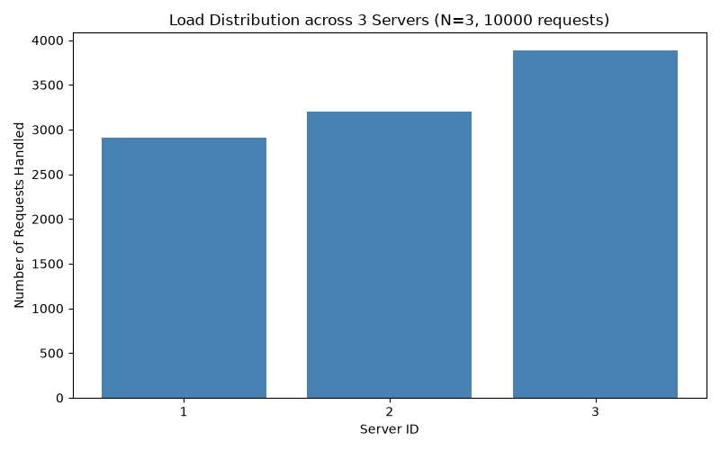
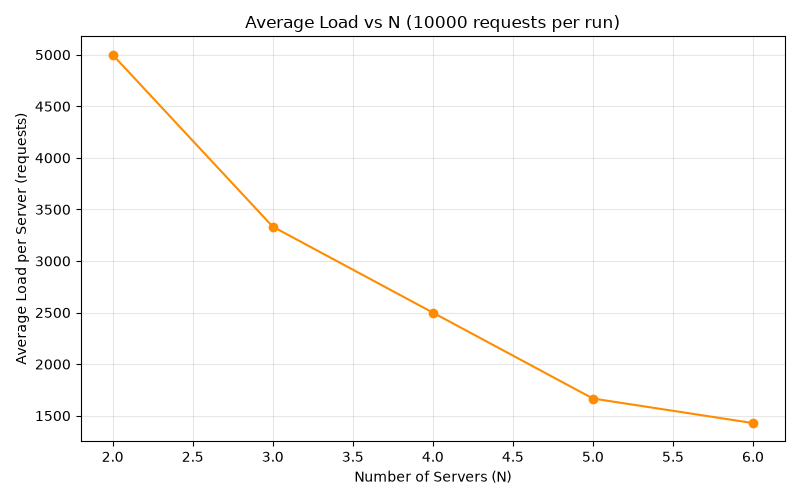

# ICS 4104 Assignment 1 — Customizable Load Balancer

## Overview
A Flask-based load balancer using consistent hashing to distribute client
requests across N dynamically managed server containers, with automatic
failure detection and recovery.

## Design Choices
- **Language**: Python (Flask for HTTP, Docker SDK for container management)
- **Architecture**: Load balancer container mounts the host Docker socket
  (`/var/run/docker.sock`) to spawn/remove server containers at runtime.
- **Consistent hashing**: 512 slots, K=9 virtual servers per physical server,
  quadratic probing on collision.
- **Heartbeat monitoring**: background thread polls `/heartbeat` on each
  server every 5 seconds; unresponsive servers are removed and replaced
  automatically to maintain N replicas.

## Assumptions
- Server hostnames are Docker container names, resolved via Docker's
  built-in DNS on the `net1` bridge network.
- Request IDs are randomly generated 6-digit integers per the spec.
- `/add` and `/rm` accept an empty hostname list to auto-generate random
  hostnames for the requested count.

## Setup & Running
```bash
docker network create net1
make build
make up
```

## Testing
- `/rep`, `/add`, `/rm` endpoints tested manually via curl — see below.
- Failure recovery tested by manually stopping a container (`docker stop <name>`)
  and confirming a replacement spawns within ~5-6 seconds.
- Load distribution tested with 10,000 concurrent async requests
  (`plot_a1.py` / `plot_a1_modified.py`) and a scaling sweep from N=2 to N=6
  (`plot_a2.py` / `plot_a2_modified.py`).

## Analysis

### A-1: Load distribution at N=3 (original hash functions)
Using the assignment's default `H(i) = i² + 2i + 17` and
`Φ(i,j) = i² + j² + 2j + 25`:


**Observation**: one server consistently absorbed ~79-88% of all traffic
across repeated runs, while the others received a small fraction. This
indicates the quadratic hash functions cluster virtual server slots
unevenly across the 512-slot ring for small server counts, rather than
spreading them uniformly.

### A-2: Scalability, N=2 to N=6 (original hash functions)


Average load per server dropped predictably as N increased (5000 → ~1400),
but the *underlying* distribution stayed skewed toward the same dominant
server at every N — scaling out added capacity but didn't fix the
imbalance, since the hash function itself was the bottleneck.

### A-3: Failure recovery
Verified live: stopping a running server container was detected by the
heartbeat monitor within one polling interval (5s), and a new replacement
server was automatically spawned, restoring N to its configured value.

### A-4: Modified hash functions
Replaced the quadratic hash functions with Python's built-in string hash
(`hash(f"req-{i}")`, `hash(f"srv-{i}-{j}")`), which mixes bits more
uniformly than a quadratic polynomial.




**Observation**: load spread across 4-6 servers roughly evenly instead of
being dominated by a single server — confirming the original imbalance was
a hash function weakness rather than a flaw in the consistent hashing
routing logic itself. A small number of `ERROR` / dropped requests were
observed during N transitions, coinciding with containers being spawned or
removed mid-test — a known race between DNS propagation and routing.

## Grading Scheme
- TASK1: Server — 20%
- TASK2: Consistent Hashing — 30%
- TASK3: Load Balancer — 30%
- TASK4: Analysis — 20%
