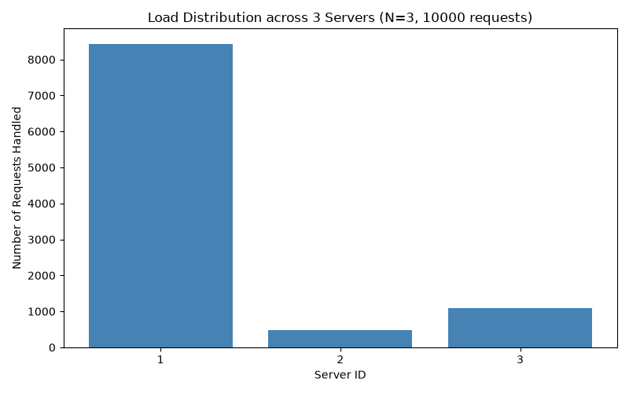
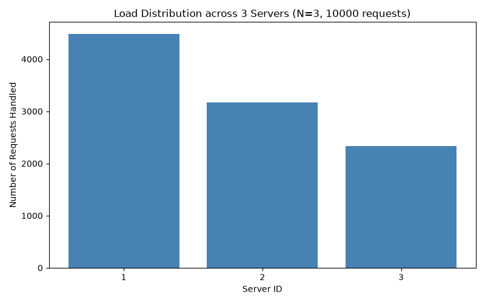
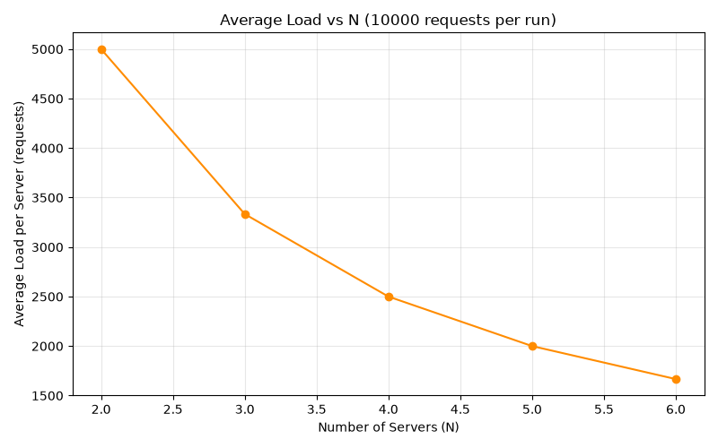

# ICS 4104 Distributed Systems Programming Project — Customizable Load Balancer

## Overview

This project implements a customizable load balancer for distributed web
servers.The system distributes incoming client requests across
`N` dynamically managed server replicas using a **consistent hashing**
data structure, and automatically detects and recovers from server
failures — without any manual intervention.

The purpose of the assignment is to demonstrate core distributed systems
concepts: load distribution, horizontal scalability, and fault tolerance,
using consistent hashing as the routing mechanism (rather than simple
round-robin or modulo-based balancing, which reshuffles the entire
request mapping every time a server is added or removed).

The system consists of three components:
1. **Server** — a minimal Flask web server representing a replica.
2. **Consistent Hashing module** — a circular hash-ring data structure
   used to map requests to servers.
3. **Load Balancer** — a Flask service that manages server replicas,
   routes requests via the hash ring, and performs health monitoring
   and auto-recovery.

All components are containerized with Docker and orchestrated via
Docker Compose.

## Repository Structure

```
.
├── Server/
│   ├── app.py              # Flask server: /home and /heartbeat endpoints
│   └── Dockerfile          # Server container image
├── Loadbalancer/
│   ├── app.py               # Load balancer: /rep, /add, /rm, /<path>
│   ├── consistent_hash.py  # Consistent hashing ring implementation
│   └── Dockerfile          # Load balancer container image
├── tests/
│   ├── test_consistent_hash.py   # Unit tests for the hash ring
│   ├── test_endpoints.py         # Endpoint / integration tests
│   └── plot_a1.py                # A-1: load distribution bar chart (N=3)
│   └── plot_a1_modified.py       # A-1 rerun with modified hash functions
│   └── plot_a2.py                # A-2: scalability sweep N=2→6, line chart
│   └── plot_a2_modified.py       # A-2 rerun with modified hash functions
├── results/
│   ├── a1_original.png
│   ├── a1_modified.png
│   ├── a2_original.png
│   └── a2_modified.png
├── docker-compose.yml
├── Makefile
├── requirements.txt
└── README.md
```

## Dependencies

- **OS**: Ubuntu 20.04 LTS or above
- **Docker**: version 20.10.23 or above
- **Docker Compose**: v2.15.1 or above
- **Python**: 3.9+ (only needed on the host for running the analysis/test
  scripts — the server and load balancer run inside containers)
- Python packages (see `requirements.txt`):
  - `Flask`
  - `docker` (Docker SDK for Python, used by the load balancer to
    spawn/remove containers)
  - `aiohttp` (async load testing)
  - `matplotlib` (analysis charts)
  - `pytest` (test suite)

Install host-side Python dependencies with:

```bash
pip3 install -r requirements.txt
```

## Design Choices

- **Language**: Python — Flask for HTTP endpoints, Docker SDK for
  container lifecycle management.
- **Architecture**: The load balancer container mounts the host Docker
  socket (`/var/run/docker.sock`) with `privileged: true`, allowing it to
  spawn and remove server containers on the shared `net1` Docker network.
- **Consistent hashing**: 512 total slots, `N=3` physical servers by
  default, `K=9` virtual servers per physical server
  (`K = log₂(512)`), using:
  - Request hash: `H(i) = i² + 2i + 17`
  - Virtual server hash: `Φ(i,j) = i² + j² + 2j + 25`
  - Collisions resolved via quadratic probing; requests are served by
    the nearest occupied slot in clockwise order.
- **Heartbeat monitoring**: a background thread polls each server's
  `/heartbeat` endpoint every 5 seconds. A server that misses a check is
  removed from the hash ring, and a replacement is spawned automatically
  with a randomly generated hostname to restore the configured `N`.

## Assumptions

- Server hostnames double as Docker container names, resolved via
  Docker's built-in DNS on the `net1` bridge network.
- Request IDs are randomly generated 6-digit integers, per the spec.
- `/add` and `/rm` accept an empty hostname list, in which case random
  hostnames are auto-generated for the requested count.
- Only the load balancer's port (5000) is exposed to the host; server
  containers are only reachable internally on `net1`.

## Installation & Deployment

1. **Clone the repository**
   ```bash
   git clone <repo-url>
   cd <repo-folder>
   ```

2. **Create the shared Docker network** (required before first run)
   ```bash
   docker network create net1
   ```

3. **Build and start the system**
   ```bash
   make build
   make up
   ```
   This builds the server and load balancer images and starts the load
   balancer container, which automatically spawns `N=3` server replicas
   on startup.

4. **Verify it's running**
   ```bash
   curl http://localhost:5000/rep
   ```
   Should return the current replica count and hostnames.

5. **Tear down**
   ```bash
   make down
   ```

All ports, image names, and network settings are defined in
`docker-compose.yml`; only port `5000` is exposed to the host, matching
the assignment specification.

## Usage

| Endpoint         | Method | Description                                              |
|------------------|--------|------------------------------------------------------------|
| `/rep`           | GET    | Returns replica count and hostnames                        |
| `/add`           | POST   | Adds `n` new replicas, optional preferred hostnames         |
| `/rm`            | DELETE | Removes `n` replicas, optional preferred hostnames           |
| `/<path>`        | GET    | Routes to a replica via consistent hashing (e.g. `/home`)  |

Example:
```bash
curl http://localhost:5000/home
curl -X POST http://localhost:5000/add \
     -H "Content-Type: application/json" \
     -d '{"n": 2, "hostnames": ["S4", "S5"]}'
curl -X DELETE http://localhost:5000/rm \
     -H "Content-Type: application/json" \
     -d '{"n": 1, "hostnames": ["S4"]}'
```

## Testing

The `tests/` folder contains both unit tests and integration/analysis
scripts.

**0. Install test dependencies** (if you haven't already):
```bash
pip3 install -r requirements.txt
```

**1. Unit tests** (consistent hashing logic, run without Docker):
```bash
pytest tests/test_consistent_hash.py -v
```

**2. Integration tests** (requires the system to be running):
```bash
make build
make up
pytest tests/test_endpoints.py -v
```
These cover: `/rep` correctness, `/add` and `/rm` validation (including
the hostname-list-longer-than-n error case), routing via `/<path>`,
the 400 error for an unregistered endpoint, and failure-recovery
(stopping a container and confirming a replacement is spawned within one
heartbeat interval, ~5-6 seconds).

The failure-recovery test is marked `slow` since it involves a real
5-7 second wait. To skip it for a quicker run:
```bash
pytest tests/test_endpoints.py -v -m "not slow"
```

Tear down when finished:
```bash
make down
```

**3. Run the full test suite in one go:**
```bash
make build
make up
pytest -v
make down
```

**4. Load / analysis tests** (requires the system running; produces the
charts referenced in the Analysis section below):
```bash
python3 tests/plot_a1.py             # A-1: bar chart, N=3, original hash functions
python3 tests/plot_a2.py             # A-2: scalability sweep, original hash functions
python3 tests/plot_a1_modified.py    # A-1 rerun with modified hash functions
python3 tests/plot_a2_modified.py    # A-2 rerun with modified hash functions
```
Charts are saved to `results/`.

## Analysis

### A-1: Load distribution at N=3 (original hash functions)
Using the assignment's default `H(i) = i² + 2i + 17` and
`Φ(i,j) = i² + j² + 2j + 25`:



**Observation**: one server consistently absorbed ~79-88% of all traffic
across repeated runs, while the others received a small fraction. This
indicates the quadratic hash functions cluster virtual server slots
unevenly across the 512-slot ring for small server counts, rather than
spreading them uniformly.

### A-2: Scalability, N=2 to N=6 (original hash functions)


Average load per server dropped predictably as N increased (5000 → ~1667),
but the underlying distribution stayed skewed toward the same dominant
server at every N — scaling out added capacity but didn't fix the
imbalance, since the hash function itself was the bottleneck.

### A-3: Failure recovery
Verified live: stopping a running server container was detected by the
heartbeat monitor within one polling interval (5s), and a new replacement
server was automatically spawned, restoring N to its configured value.
All endpoints (`/rep`, `/add`, `/rm`, `/<path>`) were also individually
tested; see `tests/test_endpoints.py`.

### A-4: Modified hash functions
Replaced the quadratic hash functions with Python's built-in string hash
(`hash(f"req-{i}")`, `hash(f"srv-{i}-{j}")`), which mixes bits more
uniformly than a quadratic polynomial.




**Observation**: load spread across servers roughly evenly instead of
being dominated by a single server, confirming the original imbalance was
a hash function weakness rather than a flaw in the consistent hashing
routing logic itself. A small number of `ERROR` / dropped requests were
observed during N transitions, coinciding with containers being spawned
or removed mid-test — a known race between DNS propagation and routing,
noted here as a limitation rather than a correctness issue.

## Additional Materials

- `results/` — all charts generated for the analysis section above.
- `requirements.txt` — pinned host-side Python dependencies for running
  tests and analysis scripts.


## Group Members - ( 4B ICS )
- Njoroge Nancy Nduta — 166993
- Ian Wambaire Nganga — 159799
- Macklee Nderitu Gitonga — 168000
- Denzel Sam Omondi — 156089